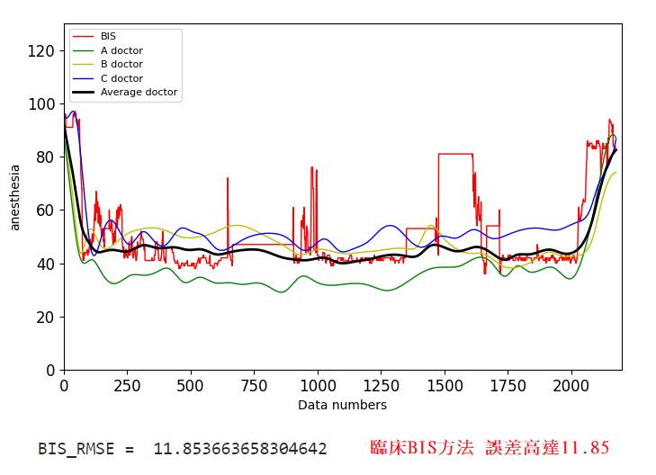
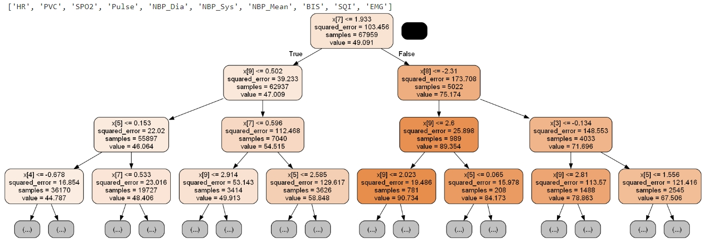
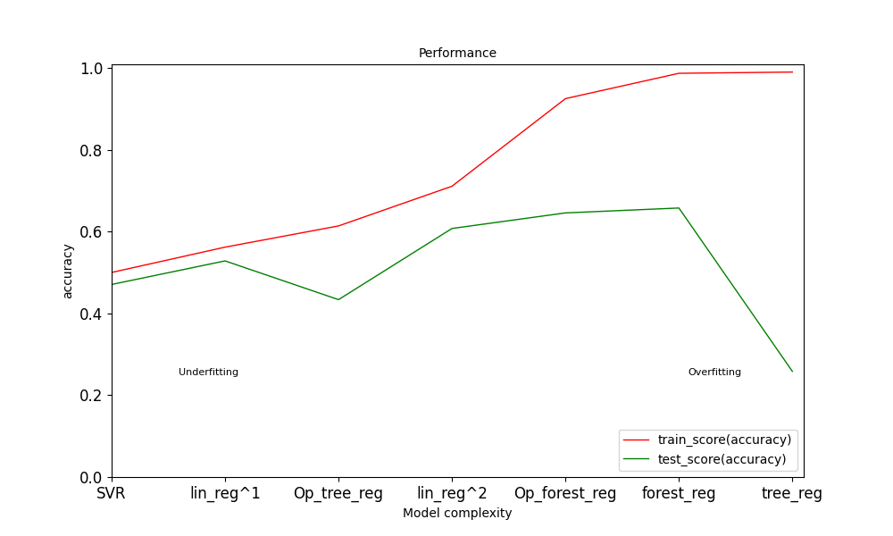
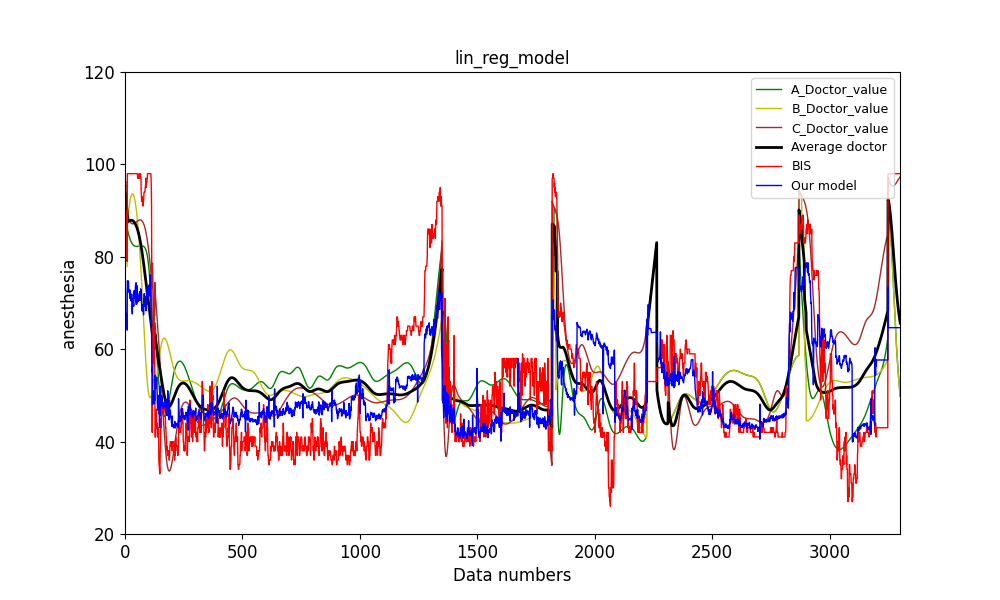
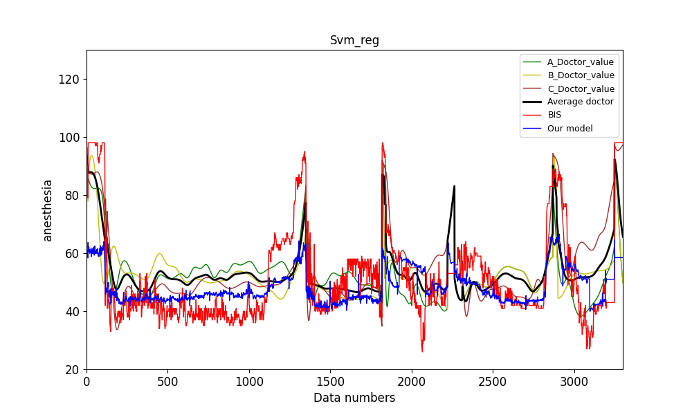
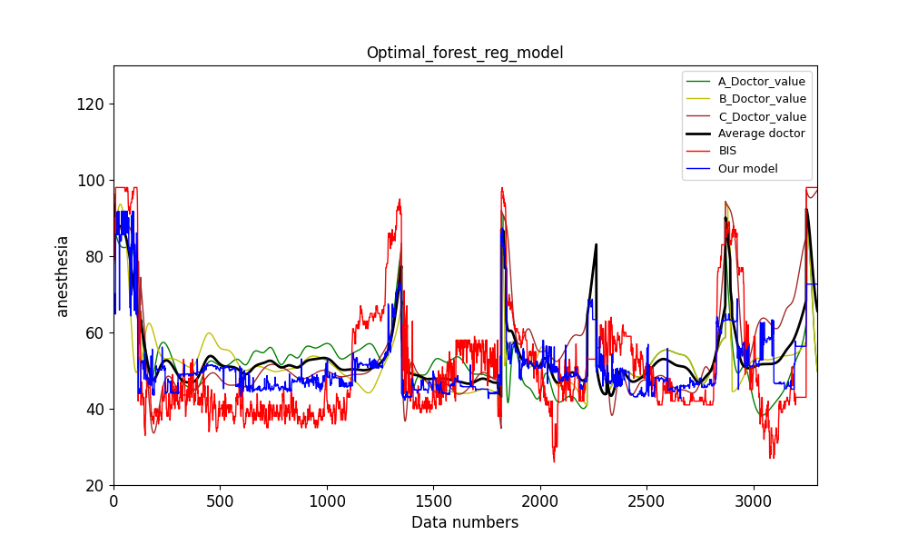
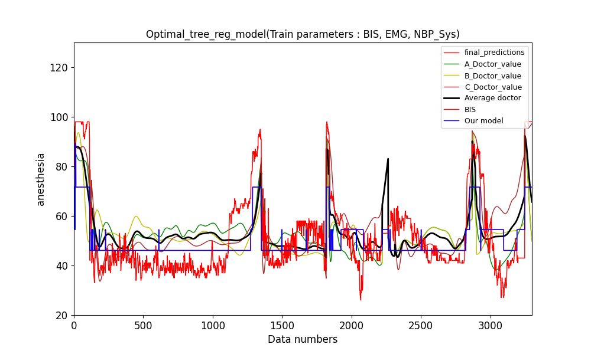
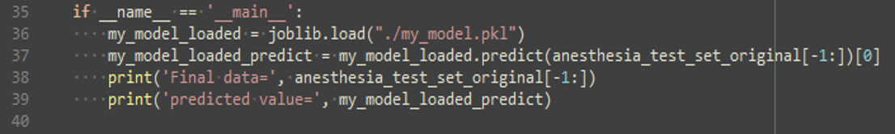
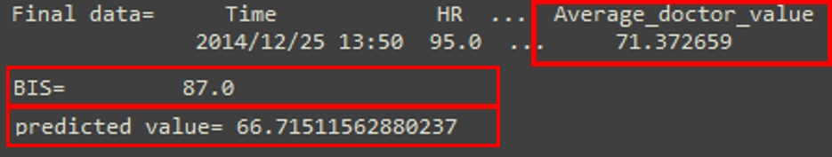

##  [人工智慧模型模擬麻醉醫生以評估手術中病人的清醒程度]
---

### Introduction
* 我們將台大醫院2014年100場手術資料當作實驗資料，並且使用多種機器學習演算法，如:多階線性迴歸、調整超參數後的決策樹迴歸和調整超參數後的隨機森林迴歸演算法，來模擬三位麻醉醫生並對測試資料進行預測評估，並比較各種迴歸模型的決定係數與預測誤差，最終選擇最佳的迴歸模型並加以預測，優化原本臨床上其中一種清醒程度評估方法(腦波雙頻指數(BIS))，提供執刀醫生更準確的病人麻醉清醒程度，避免病人在手術中甦醒且造成病人永遠的心理傷害。

* 台大醫院2014年100場手術資料
* Total data: 103,045 records
* Train set: 67960 images (64場)
* Validation set: 16990 records (16場)
* Test set: 18095 records (20場)
* Class: 
    * HR : 心率
    * PVC
    * SPO2 : 血氧濃度
    * Pulse : 脈搏
    * NBP-Sys : 靜脈血壓收縮壓
    * NBP-Dia : 靜脈血壓舒張壓
    * NBP-Mean : 靜脈血壓平均壓力
    * BIS : 腦波雙頻指數(BIS)(目前臨床上其中一種清醒程度評估方法)
    * EMG : 肌電圖數值
    * A_Doctor_value : A醫生的評估數值
    * B_Doctor_value : B醫生的評估數值
    * C_Doctor_value : C醫生的評估數值
    * Average_doctor_value : 三位醫生的平均評估數值 (labels)
    

### Dependencies and Installation
* python=3.8.18
* scikit-learn=1.2.2
* scipy=1.4.1
* numpy=1.18.5
* matplotlib=3.5.3
* pillow=6.2.1
* pandas=1.3.5

### Preparation
Because of the hospital data privacy, the project doesn't involve the dataset.

### Issues
目前評估方法(BIS)與三位醫生評估的差異仍然很大。

 

#### 隨機森林的樹結構 :

 
    
### Metrics result
|Methods|lin_reg|Poly_degree_lin_reg|SVR|Optimal_forest_reg|forest_reg|Optimal_tree_reg|tree_reg|
|-|-|-|-|-|-|-|-|
|Train score(accuracy)|0.562023|0.710967|0.500143|0.925121|0.987059|0.613913|0.990100|
|Test score(accuracy)|0.528438|0.607673|0.470762|0.645742|0.657726|0.433699|0.258408|
|Train RMSE|6.648971|0.562023|7.103162|2.749218|1.142909|6.242688|0.999632|
|Cross val score mean RMSE|6.653813|5.429202|7.103749|3.118608|1.866904|6.252218|2.483877|
|Testset RMSE|6.797394|6.081140|7.154035|5.778581|5.680002|7.306088|8.360723|

### Plot metrics chart

 

### Predicted results on test set

#### linear regression :

 

#### Support Vector Regression (SVR) :

 

#### Optimal forest regression :

 

#### Optimal tree regression :

 

#### joblib存取訓練好的模型，執行預測 :

 
    
#### 預測結果 :

 