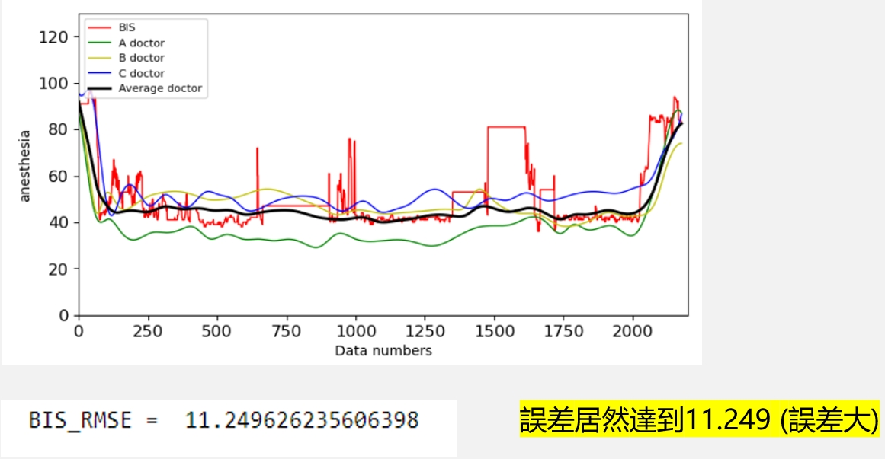
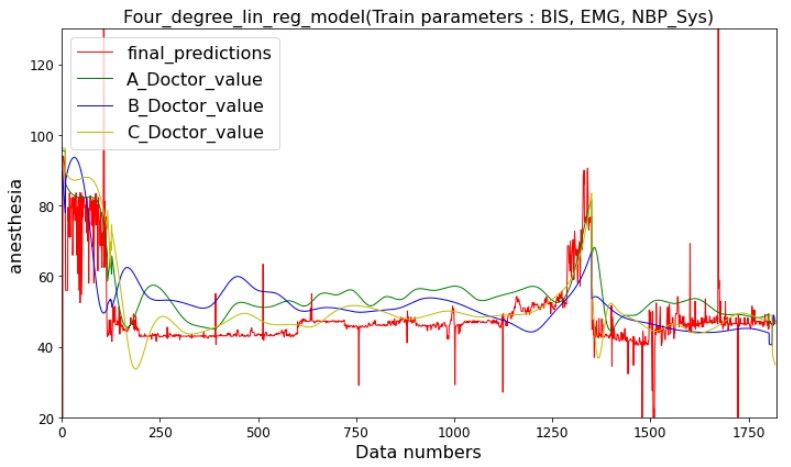
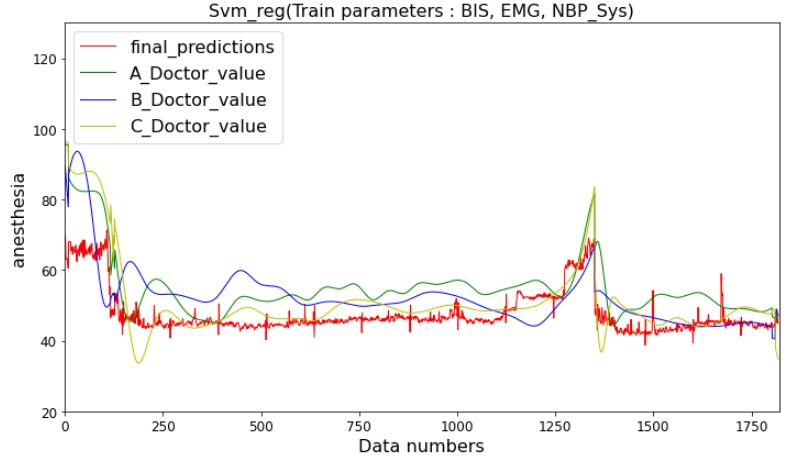
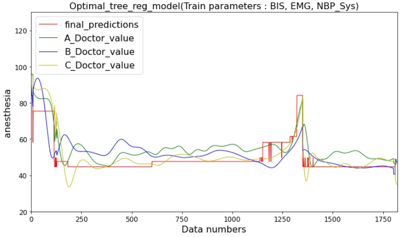

##  [人工智慧模型模擬麻醉醫生以評估手術中病人的清醒程度]
---

### Introduction
* 我們將台大醫院2014年15場手術資料當作實驗資料，並且使用多種機器學習演算法，如:多階線性回歸、調整超參數後的決策樹回歸和調整超參數後的隨機森林回歸演算法，來模擬三位麻醉醫生並對測試資料進行預測評估，並比較各種回歸模型的決定係數與預測誤差，最終選擇最佳的回歸模型並加以預測，優化原本臨床上其中一種清醒程度評估方法(腦波雙頻指數(BIS))，提供執刀醫生更準確的病人麻醉清醒程度，避免病人在手術中甦醒且造成病人永遠的心理傷害。

* 台大醫院2014年15場手術資料
* Total data: 19992 records
* Train set: 16356 images
* Validation set: 1818 records
* Test set: 1818 records 
* Class: 
    * HR : 心率
    * PVC
    * SPO2 : 血氧濃度
    * Pulse : 脈搏
    * NBP-Sys : 靜脈血壓收縮壓
    * NBP-Dia : 靜脈血壓舒張壓
    * NBP-Mean : 靜脈血壓平均壓力
    * BIS : 腦波雙頻指數(BIS)(目前臨床上其中一種清醒程度評估方法)
    * EMG : 肌電圖數值
    * A_Doctor_value : A醫生的評估數值
    * B_Doctor_value : B醫生的評估數值
    * C_Doctor_value : C醫生的評估數值
    * Average_doctor_value : 三位醫生的平均評估數值 (labels)
    

### Dependencies and Installation
* python=3.6.10
* scikit-learn=1.0.1
* scipy=1.4.0
* numpy=1.18.5
* matplotlib=3.3.4
* pillow=8.3.1
* pandas=1.3.4

### Preparation
Because of the hospital data privacy, the project doesn't involve the dataset(ALL_16_except_X.csv and NTUH_OR69_Raw_Data_20141226_4.csv).

### Issues
目前評估方法(BIS)與三位醫生評估的差異仍然很大。

 

### Metrics result
|Methods|lin_reg|Four_degree_lin_reg|SVR|Optimal_forest_reg|forest_reg|Optimal_tree_reg|tree_reg|
|-|-|-|-|-|-|-|-|
|train score(accuracy)|0.574845|0.757495|0.528444|0.980901|0.979012|0.741112|0.985094|
|test score(accuracy)|0.586759|0.607078|0.357757|0.347746|0.248663|0.558359|0.141653|
|train RMSE|6.691892|5.054000|7.047608|1.418345|1.486810|5.221933|1.253000|
|cross val score mean RMSE|6.694666|5.091466|7.053937|2.421165|2.442213|5.230948|2.808004|
|testset RMSE|6.268256|5.423508|6.933889|6.987722|7.499716|5.749924|8.016020|

### Plot metrics chart

 

### Predicted results on test set

#### linear regression :

 

#### Four degree linear regression (Best model) :

 

#### Support Vector Regression (SVR) :

 

#### Optimal forest regression :

 

#### Optimal tree regression :

 