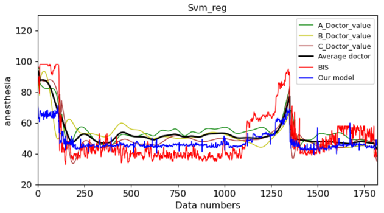
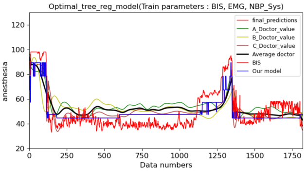

##  [人工智慧模型模擬麻醉醫生以評估手術中病人的清醒程度]
---

### Introduction
* 我們將台大醫院2014年120場手術資料當作實驗資料，並且使用多種機器學習演算法，如:多階線性迴歸、調整超參數後的決策樹迴歸和調整超參數後的隨機森林迴歸演算法，來模擬三位麻醉醫生並對測試資料進行預測評估，並比較各種迴歸模型的決定係數與預測誤差，最終選擇最佳的迴歸模型並加以預測，優化原本臨床上其中一種清醒程度評估方法(腦波雙頻指數(BIS))，提供執刀醫生更準確的病人麻醉清醒程度，避免病人在手術中甦醒且造成病人永遠的心理傷害。

* 台大醫院2014年120場手術資料
* Total data: 189921 records
* Train set: 123118 images
* Validation set: 30123 records
* Test set: 36680 records 
* Class: 
    * HR : 心率
    * PVC
    * SPO2 : 血氧濃度
    * Pulse : 脈搏
    * NBP-Sys : 靜脈血壓收縮壓
    * NBP-Dia : 靜脈血壓舒張壓
    * NBP-Mean : 靜脈血壓平均壓力
    * BIS : 腦波雙頻指數(BIS)(目前臨床上其中一種清醒程度評估方法)
    * EMG : 肌電圖數值
    * A_Doctor_value : A醫生的評估數值
    * B_Doctor_value : B醫生的評估數值
    * C_Doctor_value : C醫生的評估數值
    * Average_doctor_value : 三位醫生的平均評估數值 (labels)
    

### Dependencies and Installation
* python=3.6.10
* scikit-learn=1.0.1
* scipy=1.4.0
* numpy=1.18.5
* matplotlib=3.3.4
* pillow=8.3.1
* pandas=1.3.4

### Preparation
Because of the hospital data privacy, the project doesn't involve the dataset.

### Issues
目前評估方法(BIS)與三位醫生評估的差異仍然很大。

 

### Metrics result
|Methods|lin_reg|SVR|Optimal_forest_reg|forest_reg|Optimal_tree_reg|tree_reg|
|-|-|-|-|-|-|-|
|Train score(accuracy)|0.596208|0.536094|0.997075|0.995306|0.767031|0.998683|
|Test score(accuracy)|0.520164|0.359287|0.619447|0.566832|0.527370|0.424653|
|Train RMSE|6.569791|7.041862|0.559188|0.708375|4.990243|0.375270|
|Cross val score mean RMSE|6.574750|7.048097|1.317782|1.441573|5.062478|1.818087|
|Testset RMSE|5.993408|6.925625|5.337463|5.694497|5.948235|6.562844|

### Plot metrics chart

 

### Predicted results on test set

#### linear regression :

 

#### Support Vector Regression (SVR) :

 

#### Optimal forest regression :

 

#### Optimal tree regression :

 

